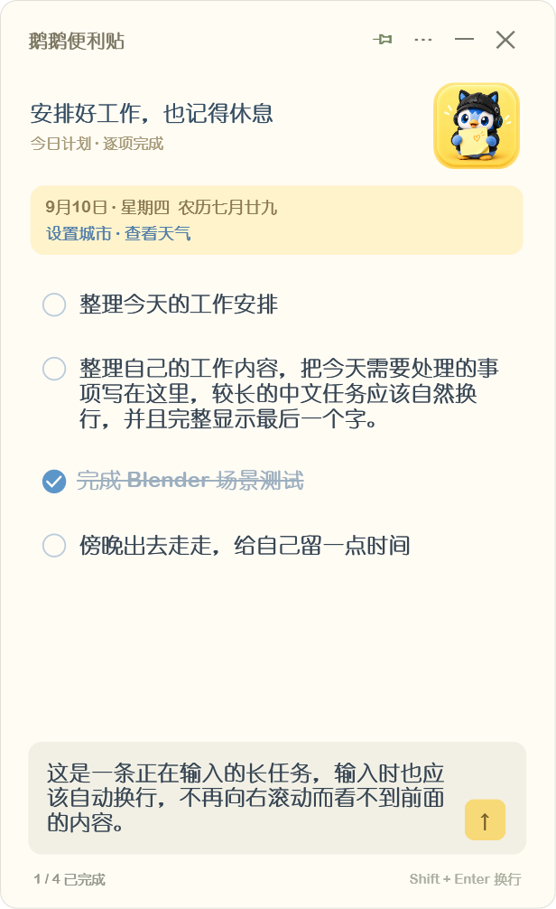

# 鹅鹅便利贴

贴在 Windows 桌面上的一张虚拟即时贴。随手记下眼前的事情，做完就划掉。

奶油色纸面、鹅鹅头像、本地自动保存，无需注册账号。



## 下载与使用

在本仓库的 Releases 下载 `GooseStickyNotes-v0.1.0-windows.zip`，解压到固定文件夹后，双击 `GooseStickyNotes.exe`。

使用 WPF / .NET Framework，面向 Windows 10 / 11。当前版本未做数字签名，兼容性验证以发布说明为准。

| 操作 | 方法 |
| --- | --- |
| 添加任务 | 底部输入，Enter 或点击 ↑ |
| 输入换行 | Shift+Enter |
| 编辑 | 直接点击任务文字 |
| 完成 / 恢复 | 点击圆形勾选框 |
| 排序 | 右键任务选择上移 / 下移；任务内按 Alt+↑ / Alt+↓ |
| 删除 | 右键任务，选择删除任务 |
| 清理完成项 | 更多菜单 → 清理已完成 |
| 置顶 | 顶部图钉按钮 |
| 隐藏 / 显示 | Ctrl+Alt+N，可在更多菜单关闭 |
| 隐藏到托盘 | 顶部 −；双击托盘图标恢复 |
| 退出 | 顶部 × 或托盘菜单 → 退出 |
| 开机启动 | 更多菜单 → 开机启动，默认关闭 |

拖动标题栏移动窗口，拖动边缘调整大小。三种纸面配色可在更多菜单切换。

全局快捷键仅在程序运行期间生效；若被其他软件占用，菜单会提示，可使用托盘恢复窗口。开机启动仅对当前 Windows 用户生效；移动 EXE 后，在新位置重新开启该选项。删除软件前请先关闭开机启动。

## 日期与天气

- 短句来自 7 条内置文案，每天轮换；日期与农历离线计算。
- 天气需自行选择城市，不自动定位；每 30 分钟更新，失败后 5 分钟重试。
- 天气和城市搜索由 [Open-Meteo](https://open-meteo.com/) 提供。请求包含查询城市名或选定城市坐标，不发送任务内容。
- 北京、上海、广州、深圳、杭州、成都、武汉、南京、香港支持离线选城；查询天气仍需联网。

## 本地保存

任务、顺序、草稿、窗口位置、配色和快捷键开关自动保存到 `%LOCALAPPDATA%\StickyTasks\tasks.xml`，保留上一版 `tasks.xml.bak`。任务不在跨天时自动清空。

软件用于短期即时记事，不提供账号、云同步或数据迁移功能。

## 从源码构建

在项目目录执行：

```powershell
powershell -ExecutionPolicy Bypass -File .\build.ps1
```

输出为 `GooseStickyNotes.exe`。构建调用 Windows 自带的 .NET Framework C# 编译器，无需联网下载构建依赖。

## 验证

```powershell
.\GooseStickyNotes.exe --verify
.\GooseStickyNotes.exe --verify-weather
```

`--verify` 使用 `qa-modern` 内的独立测试数据，不读取或修改真实任务、不设置开机启动、不注册全局快捷键。结果写入 `qa-modern/result.txt`，并生成常规 / 窄窗口截图。覆盖排序边界与顺序恢复、显示隐藏、长文本、多行输入、完成状态、草稿、农历和天气异步场景。

`--verify-weather` 实际联网检查城市搜索与天气，结果写入 `weather-result.txt`。

当前尚未完成真实中文输入法候选词、所有多显示器 DPI 组合、开机登录启动和全局热键实际按键的完整人工验收。

更新记录见 [CHANGELOG.md](CHANGELOG.md)。问题反馈请附 Windows 版本、复现步骤和截图，并隐去私人任务内容。
